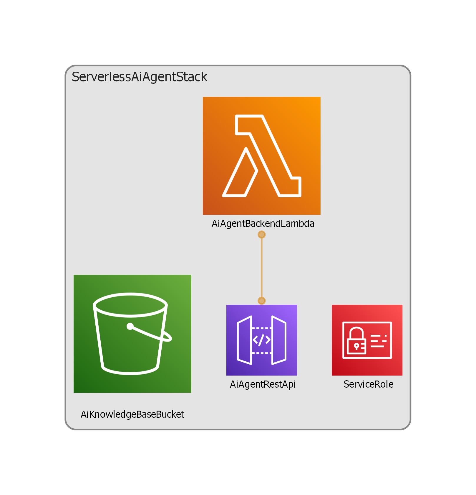

# Serverless Generative AI Agent Infrastructure

A production-grade, highly secure, and fully serverless AI orchestration backend engineered to converse with next-generation Large Language Models (LLMs) via **Amazon Bedrock**. Built entirely as Infrastructure as Code (IaC) using **AWS CDK (Python)**, this architecture deploys a cost-optimized, secure integration layer leveraging the AWS Bedrock **Converse API** [5.1].

## 🏗️ Architecture & AI Orchestration Overview

_Architecture diagram automated and generated using **AWS Kiro CLI** and **Model Context Protocol (MCP)**._
This system completely eliminates the need for expensive, 24/7 idle compute resources by adopting a **100% Serverless Pay-per-Use** financial lifecycle.

*   **API Gateway Ingestion Layer:** Exposes a secure REST endpoint (`/ask`) with pre-configured Cross-Origin Resource Sharing (CORS) to allow immediate integration with personal portfolio frontends.
*   **Decoupled Python Backend Lambda:** An optimized Python runtime handler managing transient compute tasks. It uses connection pooling and execution context reuse to dramatically mitigate cold-start latencies.
*   **Next-Gen LLM Routing:** Integrates directly with advanced foundations via Amazon Bedrock Cross-Region **Inference Profiles** (`eu.anthropic.claude-4-5-haiku`) to leverage high-throughput AI inference inside European domains [5.1].
*   **Granular Identity Security (IAM):** Implements absolute **Least Privilege** access controls, completely restricting the compute role to isolated `bedrock:Converse` actions while protecting the environment from broad asterisk vulnerability leaks.

## 🚀 Tech Stack & Core Services
*   **Infrastructure as Code:** AWS CDK (Python)
*   **AI Engine Platform:** Amazon Bedrock (Converse API Framework) [5.1]
*   **Compute Foundation:** AWS Lambda (Python 3.11 Runtime)
*   **API Management:** Amazon API Gateway (REST Framework)
*   **CI/CD & DevSecOps:** GitHub Actions, OpenID Connect (OIDC) Cryptographic Trust Federation [2.1]

---

## 🔒 DevSecOps & Enterprise Best Practices

### 1. Zero-Trust OIDC Architecture
The automated GitHub Actions workflow (`deploy.yml`) is completely federated via AWS IAM Identity Providers [2.1]. Short-lived cryptographic JSON Web Tokens (JWTs) eliminate the risky requirement of saving long-lived AWS Access Keys inside the source control repositories [2.1].

### 2. High-Performance Converse API Implementation
Unlike deprecated invocation patterns, this backend implements the modern **Bedrock Converse API** [5.1]. This framework standardizes chat payload structures, enforces strict type checking on message objects, and optimizes telemetry metrics natively through Amazon CloudWatch.

---

## 🛠️ Local Verification & Testing

### Prerequisites
*   Python 3.11+
*   AWS CDK CLI (`npm install -g aws-cdk`)
*   An active AWS commercial account with OIDC enabled for your GitHub handle [2.1]

### Manual Invocation Check
1. Active your virtual isolation block and verify package alignments:
   ```bash
   .venv\Scripts\activate   # Windows
   pip install requests boto3
   ```
2. Run the decoupled verification test script to send safe payloads to the serverless mesh:
   ```bash
   python ask_ai.py
   ```
